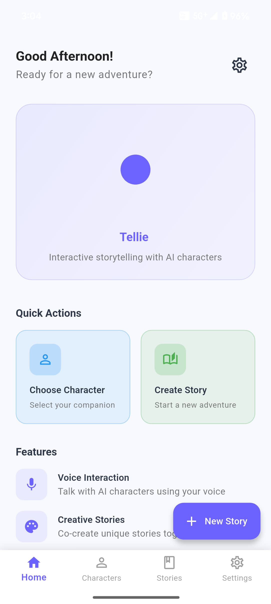
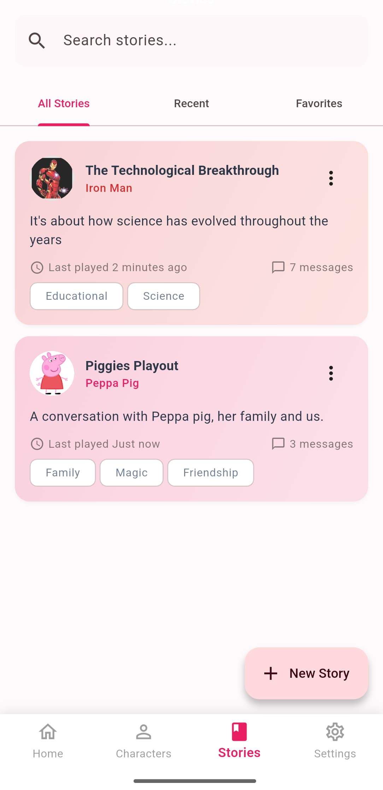
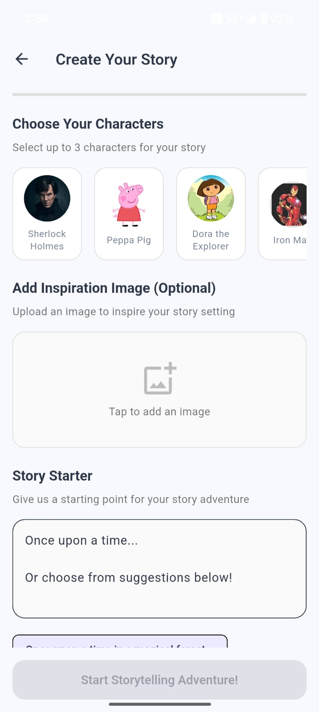
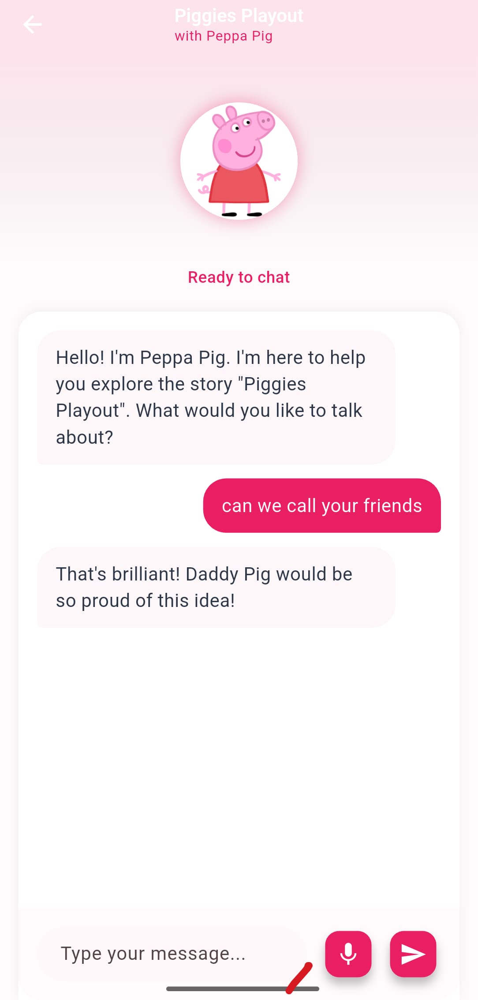

# Tellie – GenAI Storytelling & Learning Assistant

Tellie is a GenAI-powered mobile app that transforms how children engage with stories and lessons. By combining the power of LLMs and voice cloning, Tellie allows kids to choose their favorite character (like Doraemon, Olaf, or Iron Man) to explain or narrate content in a fun, personalized, and emotionally engaging way.

##  Features

- **Interactive Storytelling**: Real-time voice conversation with AI storyteller
- **Character Selection**: Choose from pre-defined characters for stories
- **Visual Inspiration**: Upload images to inspire story settings
- **Story Library**: Save and revisit completed stories
- **Animated UI**: Engaging animations with Lottie
- **Cross-Platform**: Runs on iOS and Android from single codebase
- **Child-Safe**: Content filtering and age-appropriate interactions

## Demo Preview
<p align="center">
  
  
</p>

<p align="center">
  
  
</p>

## Demo Video

* [Click here to watch the demo](https://youtu.be/A_YhZfQLER0)

## Document
* [Click here to view the document](https://docs.google.com/document/d/1u4_AcW8ruw3LccE1dUDUWyRtGesH-pzrd9nTLOdwdqw/edit?usp=sharing)

*“Lessons and stories Told your way.”*

##  Architecture

### Frontend (Flutter)
- **Framework**: Flutter 3.16.0+
- **State Management**: Riverpod + Hooks
- **Navigation**: GoRouter
- **Local Storage**: Hive
- **Audio**: Record + Just Audio
- **Real-time Communication**: LiveKit
- **Network**: Dio
- **Animations**: Lottie

### Backend (Node.js)
- **Framework**: Express.js
- **Real-time Audio**: LiveKit Server SDK
- **Speech-to-Text**: OpenAI Whisper
- **AI Responses**: OpenAI GPT-4
- **Text-to-Speech**: ElevenLabs
- **File Upload**: Multer

##  Project Structure

```
lib/
├── src/
│   ├── features/
│   │   ├── home/
│   │   │   └── presentation/
│   │   ├── story_creation/
│   │   │   ├── application/     # Riverpod controllers
│   │   │   ├── domain/          # Models and entities
│   │   │   └── presentation/    # UI widgets
│   │   └── story_library/
│   │       ├── domain/
│   │       └── presentation/
│   ├── common_widgets/          # Reusable UI components
│   ├── core/
│   │   ├── constants/           # App constants
│   │   └── theme/               # App theming
│   ├── routing/                 # Navigation setup
│   └── services/                # API clients
├── assets/
│   ├── animations/              # Lottie animations
│   ├── audio/                   # Sound effects
│   └── images/                  # Static images
└── main.dart
```

##  Getting Started

### Prerequisites

- **Flutter**: 3.16.0 or higher
- **Dart**: 3.8.0 or higher
- **Node.js**: 16.0.0 or higher (for backend)
- **iOS**: Xcode 15+ (for iOS development)
- **Android**: Android Studio with API level 21+

### Flutter Setup

1. **Clone the repository**
   ```bash
   git clone <repository-url>
   cd rakshu
   ```

2. **Install Flutter dependencies**
   ```bash
   flutter pub get
   ```

3. **Generate Hive adapters**
   ```bash
   flutter packages pub run build_runner build
   ```

4. **Run the app**
   ```bash
   # For iOS
   flutter run -d ios
   
   # For Android
   flutter run -d android
   ```

### Backend Setup

1. **Navigate to project root and setup backend**
   ```bash
   # Copy the backend package.json
   cp backend-package.json package.json
   
   # Install Node.js dependencies
   npm install
   ```

2. **Set up environment variables**
   ```bash
   # Create .env file
   LIVEKIT_API_KEY=your-livekit-api-key
   LIVEKIT_API_SECRET=your-livekit-api-secret
   OPENAI_API_KEY=your-openai-api-key
   ELEVENLABS_API_KEY=your-elevenlabs-api-key
   ```

3. **Start the backend server**
   ```bash
   # Development mode
   npm run dev
   
   # Production mode
   npm start
   ```

4. **Verify backend is running**
   ```bash
   curl http://localhost:3000/health
   ```

##  Key Components

### Story Creation Flow

1. **Home Screen**: Entry point with beautiful animations
2. **Story Setup**: Character selection, image upload, initial prompt
3. **Interactive Storytelling**: Real-time voice interaction with AI
4. **Story Library**: Browse and manage saved stories

### State Management

The app uses **Riverpod** for robust state management:

- `StorySetupController`: Manages story creation setup
- `StorytellingController`: Handles real-time storytelling session
- Providers for services (API, audio, etc.)

### Audio Pipeline

1. **Recording**: Uses `record` package for audio capture
2. **Upload**: Sends audio to backend via Dio
3. **Processing**: Backend handles STT → LLM → TTS pipeline
4. **Playback**: Uses `just_audio` for AI response playback

## 🔧 Configuration

### App Constants

Key configuration in `lib/src/core/constants/app_constants.dart`:

- API endpoints
- Animation paths
- UI dimensions
- Audio settings
- Content filtering

### Theming

Custom theme implementation in `lib/src/core/theme/app_theme.dart`:

- Light and dark mode support
- Child-friendly color palette
- Consistent typography with Poppins font

##  Platform-Specific Setup

### iOS

1. Update `ios/Runner/Info.plist` with required permissions:
   ```xml
   <key>NSMicrophoneUsageDescription</key>
   <string>This app needs microphone access for voice storytelling.</string>
   <key>NSPhotoLibraryUsageDescription</key>
   <string>This app needs photo access to add inspiration images.</string>
   ```

2. Set deployment target to iOS 12.0+ in Xcode

### Android

1. Update `android/app/src/main/AndroidManifest.xml`:
   ```xml
   <uses-permission android:name="android.permission.RECORD_AUDIO" />
   <uses-permission android:name="android.permission.READ_EXTERNAL_STORAGE" />
   <uses-permission android:name="android.permission.INTERNET" />
   ```

2. Set minimum SDK version to 21 in `android/app/build.gradle`

##  Security & Privacy

- All AI interactions are proxied through backend with content filtering
- Child-safe personality enforced in AI prompts
- No sensitive data stored locally
- Audio recordings are temporary and deleted after processing
- Parental controls and content moderation

##  Deployment

### Flutter App

```bash
# Build for release
flutter build apk --release  # Android
flutter build ios --release  # iOS
```

**Tellie ** - Empowering children's creativity through interactive storytelling! 🌟📚✨
